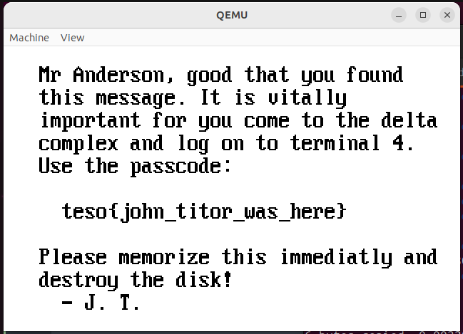

Walk-through for solving 2bitsin's Secret message from a traveller  
https://crackmes.one/crackme/650c14b528b5870bef26308d

# Files included
```
README.md               this full walk-through

floppy.img              original challenge file
mbr.bin                 extracted master boot record
mbr.bin.txt             Ghidra disassembly of master boot record
secureos.bin            extracted file from floppy file system

target.xml              some gdb scripts to help with real mode
gdb_init_real_mode.txt
i386-32bit.xml

xteadec.cpp             simple xtea decryptor source
xteadec                 pre-built xtea decryptor

decrypted.bin           decrypted version of secureos.bin
mbr_patch               patch to bypass some mbr steps

floppy2.img             the solved challenge, save this for last
images/                 images embedded in README.md
```

# Challenge

We have a floppy disk image:
```
$ file floppy.img
floppy.img: , code offset 0x3b+3, OEM-ID "ERR 401", root entries 224, sectors 2880 (volumes <=32 MB), sectors/FAT 9, sectors/track 18, serial number 0x117bceb9, label: "INPCWETRUST", FAT (12 bit), followed by FAT
```

Let's see if we can boot it:
```
$ sudo apt install qemu-system -y
$ qemu-system-i386 -drive format=raw,file=floppy.img

$ qemu-system-x86_64 -drive format=raw,file=floppy.img
```

Each of these gives the same error:
```
Booting from Hard Disk...
ERR 401
```

Pressing any key just repeats this in a loop.
'ERR 401' is the disk ID, so it's not immediately clear if the boot sector is printing that or qemu.

We can mount the image and copy any files off of it:
```
$ mkdir floppy
$ sudo mount -o loop floppy.img floppy
$ ls floppy
secureos.bin
$ cp floppy/* .
$ sudo umount floppy
$ rmdir floppy
```

And see if that file is anything recognizable:
```
$ file secureos.bin
secureos.bin: OpenPGP Secret Key
$ gpg --list-packets secureos.bin
gpg: packet(5) with unknown version 169
gpg: [don't know]: invalid packet (ctb=47)
gpg: [don't know]: invalid packet (ctb=25)
gpg: [don't know]: invalid packet (ctb=61)
gpg: aead encrypted packet with unknown version 143
gpg: uncompressing failed: Unknown compression algorithm
```


We could check for other partitions maybe:
```
$ fdisk -lu floppy.img
Disk floppy.img: 1.41 MiB, 1474560 bytes, 2880 sectors
Units: sectors of 1 * 512 = 512 bytes
Sector size (logical/physical): 512 bytes / 512 bytes
I/O size (minimum/optimal): 512 bytes / 512 bytes
Disklabel type: dos
Disk identifier: 0x0bebc166

Device      Boot      Start        End    Sectors   Size Id Type
floppy.img1        23468427 1740210269 1716741843 818.6G e3 DOS R/O
floppy.img2      3955320324 7230114824 3274794501   1.5T c3 unknown
floppy.img3       694605873 4080245556 3385639684   1.6T d8 unknown
floppy.img4      1329943125 2643367079 1313423955 626.3G c7 Syrinx

Partition table entries are not in disk order.
```

And this is nonsense, but I don't use fdisk that often and probably did something wrong here.

We can grab the MBR:
```
$ dd if=floppy.img of=mbr.bin bs=512 count=1
1+0 records in
1+0 records out
512 bytes copied, 0.00105883 s, 484 kB/s
```

And open it in Ghidra using x86:LE:16:Real Mode as the language and set the base address to 0000:0x7c00,
which is where the MBR gets loaded at boot time.

# First look into the the Master Boot Record
              
The entire MBR gets executed from the beginning.

We can go to address 7c00 and choose Disassemble from the context menu (or press D) to see the initial jump past the volume information:
```
0000:7c00 e9 3b 00        JMP        LAB_0000_7c3e

                      s_ERR_401_0000_7c03                             XREF[1]:     FUN_0000_7d81:0000:7d83(R)  
0000:7c03 45 52 52        ds         "ERR 401"
          20 34 30 
          31 00
...
                      LAB_0000_7c3e                                   XREF[1]:     0000:7c00(j)  
0000:7c3e 31 c0           XOR        AX,AX
0000:7c40 8e d8           MOV        DS,AX
0000:7c42 8e d0           MOV        SS,AX
0000:7c44 bc 00 7c        MOV        SP,0x7c00
0000:7c47 88 16 24 7c     MOV        byte ptr [drive_index],DL
0000:7c4b b8 00 08        MOV        AX,0x800
0000:7c4e cd 13           INT 0x13
```

This points SP to the beginning of the sector, saves the drive number, and uses int 0x13 to 'Read Drive Parameters'
https://en.wikipedia.org/wiki/INT_13H#INT_13h_AH=08h:_Read_Drive_Parameters

Let's look around for some interesting parts.

Here's where our 'ERR 401' message gets printed:
```
                      FUN_0000_7d81                                   XREF[1]:     FUN_0000_7d74:0000:7d78(c)  
0000:7d81 50              PUSH       AX
0000:7d82 53              PUSH       BX
                      LAB_0000_7d83                                   XREF[1]:     0000:7d8e(j)  
0000:7d83 ac              LODSB      SI=>s_ERR_401_0000_7c03                          = "ERR 401"
0000:7d84 08 c0           OR         AL,AL
0000:7d86 74 08           JZ         LAB_0000_7d90
0000:7d88 31 db           XOR        BX,BX
0000:7d8a b4 0e           MOV        AH,0xe
0000:7d8c cd 10           INT 0x10
0000:7d8e eb f3           JMP        LAB_0000_7d83
                      LAB_0000_7d90                                   XREF[1]:     0000:7d86(j)  
0000:7d90 5b              POP        BX
0000:7d91 58              POP        AX
0000:7d92 c3              RET
```

This is called from here, followed by getchar (int 0x16 with AH=0) and reset (int 0x19),
which is exactly what we've been seeing after booting:
```
                      FUN_0000_7d74                                   XREF[3]:     0000:7cac(c), 0000:7d36(j), 
                                                                                   FUN_0000_7d41:0000:7d71(j)  
0000:7d74 fc              CLD
0000:7d75 be 03 7c        MOV        SI,0x7c03
0000:7d78 e8 06 00        CALL       FUN_0000_7d81                                    undefined FUN_0000_7d81()
0000:7d7b 31 c0           XOR        AX,AX
0000:7d7d cd 16           INT 0x16
0000:7d7f cd 19           INT 0x19
```

There are a few different ways to reach this, and it's a dead end we are trying to avoid.
Presumably secureos.bin needs to get loaded into memory, some sort of checks need to happen that are currently failing, and then control ultimately transferred somehow.

# Loading from disk

Here's the disk layout given some proper labels per 
https://board.flatassembler.net/topic.php?p=65958
```
0000:7c00 e9 3b 00        JMP        LAB_0000_7c3e
                      OEM_name                                        XREF[1]:     print_ERR_401:0000:7d83(R)  
0000:7c03 45 52 52        ds         "ERR 401"
          20 34 30 
          31 00
0000:7c0b 00 02           dw         200h
                      sectors_per_cluster                             XREF[1]:     0000:7cc5(R)  
0000:7c0d 01              db         1h
                      reserved_sector_count                           XREF[1]:     0000:7c5f(R)  
0000:7c0e 01 00           dw         1h
                      num_file_alloc_tables
0000:7c10 02              db         2h
                      max_root_entries                                XREF[2]:     0000:7c76(R), 0000:7c94(R)  
0000:7c11 e0 00           dw         E0h
                      total_sectors
0000:7c13 40 0b           dw         B40h
                      media_descriptor
0000:7c15 f0              db         F0h
                      sectors_per_FAT                                 XREF[2]:     0000:7c62(R), 0000:7c72(R)  
0000:7c16 09 00           dw         9h
                      sectors_per_track                               XREF[1]:     0000:7c5b(W)  
0000:7c18 12 00           dw         12h
                      num_heads                                       XREF[1]:     0000:7c54(W)  
0000:7c1a 02 00           dw         2h
```

Let's see what happens after the int 0x13 to Read Drive Parameters we saw earlier:
```
0000:7c4e cd 13           INT        0x13
0000:7c50 c1 ea 08        SHR        DX,0x8
0000:7c53 42              INC        DX
0000:7c54 89 16 1a 7c     MOV        word ptr [num_heads],DX                          = 2h
0000:7c58 83 e1 3f        AND        CX,0x3f
0000:7c5b 89 0e 18 7c     MOV        word ptr [sectors_per_track],CX                  = 12h
0000:7c5f a1 0e 7c        MOV        AX,[reserved_sector_count]                       = 1h
0000:7c62 8b 0e 16 7c     MOV        CX,word ptr [sectors_per_FAT]                    = 9h
0000:7c66 bb 80 8e        MOV        BX,0x8e80
0000:7c69 8e c3           MOV        ES,BX
0000:7c6b 31 db           XOR        BX,BX
0000:7c6d e8 d1 00        CALL       read_sectors
```

It updates the disk layout in memory with the system's view of them, then sets up for the call to FUN_0000_7d41, which we'll rename read_sectors since it looks like this:
```
                      read_sectors                                    XREF[3]:     0000:7c6d(c), 0000:7c8b(c), 
                                                                                   0000:7cd1(c)  
0000:7d41 50              PUSH       AX
0000:7d42 52              PUSH       DX
0000:7d43 51              PUSH       CX
0000:7d44 53              PUSH       BX
0000:7d45 31 d2           XOR        DX,DX
0000:7d47 f7 36 18 7c     DIV        word ptr [0x7c18]
0000:7d4b 42              INC        DX
0000:7d4c 89 d3           MOV        BX,DX
0000:7d4e 31 d2           XOR        DX,DX
0000:7d50 f7 36 1a 7c     DIV        word ptr [0x7c1a]
0000:7d54 89 c1           MOV        CX,AX
0000:7d56 86 e9           XCHG       CL,CH
0000:7d58 c0 e1 06        SHL        CL,0x6
0000:7d5b 83 e3 3f        AND        BX,0x3f
0000:7d5e 09 d9           OR         CX,BX
0000:7d60 c1 e2 08        SHL        DX,0x8
0000:7d63 8a 16 24 7c     MOV        DL,byte ptr [0x7c24]
0000:7d67 5b              POP        BX
0000:7d68 58              POP        AX
0000:7d69 50              PUSH       AX
0000:7d6a b4 02           MOV        AH,0x2
0000:7d6c cd 13           INT        0x13
0000:7d6e 59              POP        CX
0000:7d6f 5a              POP        DX
0000:7d70 58              POP        AX
0000:7d71 72 01           JC         print_ERR_and_RST
0000:7d73 c3              RET
```

This is mostly a lot of track, head, sector math for locating what to read off the disk.

We can watch all of this happen in gdb.  
Connecting is straight-forward:
```
$ qemu-system-i386 -drive format=raw,file=floppy.img -s -S &
[1] 5305
$ gdb
(gdb) target remote :1234
Remote debugging using :1234
warning: No executable has been specified and target does not support
determining executable automatically.  Try using the "file" command.
0x0000fff0 in ?? ()
(gdb) set architecture i8086
The target architecture is set to "i8086".
(gdb) b *0x7c00
Breakpoint 1 at 0x7c00
(gdb) c
Continuing.

Breakpoint 1, 0x00007c00 in ?? ()
(gdb) x /i $pc
=> 0x7c00:    jmp    0x52457c40
(gdb) si
0x00007c3e in ?? ()
(gdb) x /5i $pc
=> 0x7c3e:    xor    eax,eax
   0x7c40:    mov    ds,eax
   0x7c42:    mov    ss,eax
   0x7c44:    mov    esp,0x16887c00
   0x7c49:    and    al,0x7c
```

And checking the inputs to read_sectors:
```
(gdb) b *0x7d41
Breakpoint 2 at 0x7d41
(gdb) c
Continuing.

Breakpoint 2, 0x00007d41 in ?? ()
(gdb) info registers ax bx cx dx es
ax             0x1                 1
bx             0x0                 0
cx             0x9                 9
dx             0x3                 3
es             0x8e80              36480
```

Versus to the actual int 0x13
```
(gdb) b *0x7d6c
Breakpoint 3 at 0x7d6c
(gdb) c
Continuing.

Breakpoint 3, 0x00007d6c in ?? ()
(gdb) x /i $pc
=> 0x7d6c:    int    0x13
(gdb) info registers ah al ch cl dh dl es bx
ah             0x2                 2
al             0x9                 9
ch             0x0                 0
cl             0x2                 2
dh             0x0                 0
dl             0x80                -128
es             0x8e80              36480
bx             0x0                 0
```

See the docs on int 0x13 at eg. https://en.wikipedia.org/wiki/INT_13H#INT_13h_AH=02h:_Read_Sectors_From_Drive

This means we're going to read in 9 sectors from cylinder 0, sector 2, head 0, drive 0x80 into 0x8e80:0

Skipping interrupts is fraught with complications when kernel debugging, so the easiest thing to do is just set a breakpoint right after it and continue:
```
(gdb) b *0x7d6e
Breakpoint 4 at 0x7d6e
(gdb) c
Continuing.

Breakpoint 4, 0x00007d6e in ?? ()
(gdb) info registers eflags
eflags         0x246               [ IOPL=0 IF ZF PF ]
```

Read Sectors sets the carry flag when there's an error, so this seems to have worked:
```
(gdb) x /32b ($es << 4) + $bx
0x8e800: 0xf0  0xff  0xff  0x00  0x40  0x00  0x05  0x60
0x8e808: 0x00  0x07  0x80  0x00  0x09  0xa0  0x00  0x0b
0x8e810: 0xc0  0x00  0x0d  0xe0  0x00  0x0f  0x00  0x01
0x8e818: 0x11  0x20  0x01  0x13  0x40  0x01  0x15  0x60
```

This looks like the start of a File Allocation Table at offset 0x200 in floppy.img, so this all seems reasonable.

We need to figure out what's actually triggering the error message.

# Failure tracing

Checking references, there are three ways to get to our failure code at 0x7d74, 
which we can go ahead and name print_ERR_and_RST:
```
0000:7cac		JMP print_ERR_and_RST	UNCONDITIONAL_CALL
0000:7d36		JNZ print_ERR_and_RST	CONDITIONAL_JUMP
0000:7d71		JC print_ERR_and_RST	CONDITIONAL_JUMP
```

We can set breaks on all of these and see which one will actually jump to our failure code,
where ($eflags & 0x40) is ZF and ($eflags & 1) is CF, checked by the conditional jumps:
```
(gdb) b *0x7cac
Breakpoint 9 at 0x7cac
(gdb) b *0x7d36 if ($eflags & 0x40) == 0
Breakpoint 10 at 0x7d36
(gdb) b *0x7d71 if ($eflags & 1) == 1
Breakpoint 11 at 0x7d71
(gdb) c
Continuing.

Breakpoint 10, 0x00007d36 in ?? ()
(gdb) x /i $pc
=> 0x7d36:  jne    0x7d74
(gdb) info registers eflags
eflags         0x697               [ IOPL=0 DF IF SF AF PF CF ]
(gdb) si
0x00007d74 in ?? ()
```

Since this failure isn't happening inside of read_sectors, we should be able to skip over loops involving it and narrow our focus a bit:
```
                      LAB_0000_7d00                                   XREF[1]:     0000:7cbc(j)  
0000:7d00 8c c3           MOV        BX,ES
0000:7d02 b8 04 e4        MOV        AX,0xe404
0000:7d05 8e c0           MOV        ES,AX
0000:7d07 31 ff           XOR        DI,DI
0000:7d09 b8 00 08        MOV        AX,0x800
0000:7d0c 8e d8           MOV        DS,AX
                      LAB_0000_7d0e                                   XREF[1]:     0000:7d20(j)  
0000:7d0e 31 f6           XOR        SI,SI
0000:7d10 e8 80 00        CALL       FUN_0000_7d93                                    undefined FUN_0000_7d93()
0000:7d13 83 c6 08        ADD        SI,0x8
0000:7d16 e8 7a 00        CALL       FUN_0000_7d93                                    undefined FUN_0000_7d93()
0000:7d19 8c d8           MOV        AX,DS
0000:7d1b 40              INC        AX
0000:7d1c 8e d8           MOV        DS,AX
0000:7d1e 39 d8           CMP        AX,BX
0000:7d20 72 ec           JC         LAB_0000_7d0e
0000:7d22 fd              STD
0000:7d23 b8 00 f0        MOV        AX,0xf000
0000:7d26 8e c0           MOV        ES,AX
0000:7d28 31 ff           XOR        DI,DI
0000:7d2a 8e df           MOV        DS,DI
0000:7d2c be f2 7d        MOV        SI,0x7df2
0000:7d2f b9 07 00        MOV        CX,0x7
                      LAB_0000_7d32                                   XREF[1]:     0000:7d39(j)  
0000:7d32 ac              LODSB      SI=>DAT_0000_7df2                                = C7h
0000:7d33 26 00 05        ADD        byte ptr ES:[DI],AL
0000:7d36 75 3c           JNZ        print_ERR_and_RST
0000:7d38 47              INC        DI
0000:7d39 e2 f7           LOOP       LAB_0000_7d32
0000:7d3b fc              CLD
0000:7d3c ea 00 00        JMPF       LAB_0000_8000
          00 08
```

This is still a decent bit to unpack, but just to give you some sense of what we're looking at, 
LAB_0000_7d0e is a decryption loop, LAB_0000_7d32 is a verification loop, and then the code either fails out or does a far jump to the loaded program code.

# Verification loop

Let's look at what needs to happen to pass the verification:
```
0000:7d22 fd              STD
0000:7d23 b8 00 f0        MOV        AX,0xf000
0000:7d26 8e c0           MOV        ES,AX
0000:7d28 31 ff           XOR        DI,DI
0000:7d2a 8e df           MOV        DS,DI
0000:7d2c be f2 7d        MOV        SI,0x7df2
0000:7d2f b9 07 00        MOV        CX,0x7
                      LAB_0000_7d32                                   XREF[1]:     0000:7d39(j)  
0000:7d32 ac              LODSB      SI=>DAT_0000_7df2                                = C7h
0000:7d33 26 00 05        ADD        byte ptr ES:[DI],AL
0000:7d36 75 3c           JNZ        print_ERR_and_RST
0000:7d38 47              INC        DI
0000:7d39 e2 f7           LOOP       LAB_0000_7d32
...
0000:7dec cc              ??         CCh
0000:7ded c9              ??         C9h
0000:7dee ca              ??         CAh
0000:7def c7              ??         C7h
0000:7df0 ba              ??         BAh
0000:7df1 ce              ??         CEh
                      DAT_0000_7df2                                   XREF[1]:     0000:7d32(R)  
0000:7df2 c7              undefined1 C7h
```

LODSB is equivalent to AL = DS:SI; SI = SI - 1 (decrements since STD set direction flag)
LOOP decrements CX and jumps back up to this point

For us here, it starts with AL = byte ptr [0x7df2], then moves downward each loop iteration (to AL = byte ptr [0x7df1], etc)

As AL moves down through its buffer, each byte is added to the byte at 0xf000:[DI], where DI starts at 0 and is incremented each time.
This addition has to result in a value of 0 each time in order for the verification to pass.

Ie. the following must hold true:
```
0xf000:[0] + 0xC7 == 0
0xf000:[1] + 0xCE == 0
0xf000:[2] + 0xBA == 0
0xf000:[3] + 0xC7 == 0
0xf000:[4] + 0xCA == 0
0xf000:[5] + 0xC9 == 0
0xf000:[6] + 0xCC == 0
```

Recovering the required string at 0xf000:[0] by the end of decrytion:
```
Python 3.9.2 (tags/v3.9.2:1a79785, Feb 19 2021, 13:44:55) [MSC v.1928 64 bit (AMD64)] on win32
Type "help", "copyright", "credits" or "license()" for more information.
>>> added = b'\xc7\xce\xba\xc7\xca\xc9\xcc'
>>> ''.join([chr((0 - c) & 0xff) for c in added])
'92F9674'
```

The problem with this is 0xf000:0000 is read-only BIOS ROM in 16-bit real mode.

# Identifying the decryption type

We need to turn our focus to the decryption loop:
```
                      LAB_0000_7d00                                   XREF[1]:     0000:7cbc(j)  
0000:7d00 8c c3           MOV        BX,ES
0000:7d02 b8 04 e4        MOV        AX,0xe404
0000:7d05 8e c0           MOV        ES,AX
0000:7d07 31 ff           XOR        DI,DI
0000:7d09 b8 00 08        MOV        AX,0x800
0000:7d0c 8e d8           MOV        DS,AX
                      LAB_0000_7d0e                                   XREF[1]:     0000:7d20(j)  
0000:7d0e 31 f6           XOR        SI,SI
0000:7d10 e8 80 00        CALL       FUN_0000_7d93                                    undefined FUN_0000_7d93()
0000:7d13 83 c6 08        ADD        SI,0x8
0000:7d16 e8 7a 00        CALL       FUN_0000_7d93                                    undefined FUN_0000_7d93()
0000:7d19 8c d8           MOV        AX,DS
0000:7d1b 40              INC        AX
0000:7d1c 8e d8           MOV        DS,AX
0000:7d1e 39 d8           CMP        AX,BX
0000:7d20 72 ec           JC         LAB_0000_7d0e
```

Whatever interesting is happening must happen in FUN_0000_7d93:
```
                      FUN_0000_7d93                                   XREF[2]:     0000:7d10(c), 0000:7d16(c)  
0000:7d93 66 60           PUSHAD
0000:7d95 b9 40 00        MOV        CX,0x40
0000:7d98 66 ba 40        MOV        EDX,0x8dde6e40
          6e de 8d
                      LAB_0000_7d9e                                   XREF[1]:     0000:7db3(j)  
0000:7d9e fc              CLD
0000:7d9f 66 89 d3        MOV        EBX,EDX
0000:7da2 e8 13 00        CALL       FUN_0000_7db8                                    undefined FUN_0000_7db8()
0000:7da5 66 81 ea        SUB        EDX,0x9e3779b9
          b9 79 37 9e
0000:7dac fd              STD
0000:7dad 66 89 d3        MOV        EBX,EDX
0000:7db0 e8 09 00        CALL       FUN_0000_7dbc                                    undefined FUN_0000_7dbc()
0000:7db3 e2 e9           LOOP       LAB_0000_7d9e
0000:7db5 66 61           POPAD
0000:7db7 c3              RET
```

Alright, that's looking a lot like TEA decryption (you can start Googling weird constants in a situation like this if you don't recognize them.)

Looking inside Ghidra's decompilation of FUN_0000_7db8:
```
  *puVar1 = *puVar1 - (*unaff_SI + (uVar2 >> 5 ^ uVar2 << 4) ^
                      *(long *)((int)((in_EBX >> 0xb & 3) << 2) + unaff_DI) + in_EDX);
```

Correction.  That's looking a lot like XTEA decryption.
https://en.wikipedia.org/wiki/XTEA

We're going to have to look at which registers are used for what, and if this is a full XTEA implementation or some variant.
Presumably we're not expected to brute force a full 128-bit key, but this could be where the steganography mentioned in the description comes into play.

# XTEA decryption

Here's what XTEA decryption typically looks like
(from https://en.wikipedia.org/wiki/XTEA):
```
void decipher(unsigned int num_rounds, uint32_t v[2], uint32_t const key[4]) {
    unsigned int i;
    uint32_t v0=v[0], v1=v[1], delta=0x9E3779B9, sum=delta*num_rounds;
    for (i=0; i < num_rounds; i++) {
        v1 -= (((v0 << 4) ^ (v0 >> 5)) + v0) ^ (sum + key[(sum>>11) & 3]);
        sum -= delta;
        v0 -= (((v1 << 4) ^ (v1 >> 5)) + v1) ^ (sum + key[sum & 3]);
    }
    v[0]=v0; v[1]=v1;
}
```
It takes in a 64-bit data chunk and a 128-bit key, and sets up a starting 'sum' based on the number 
of rounds to be performed, then performs that many rounds, adjusting down the sum during the middle of each.
 
Here's a reminder of what we're currently staring at:
```
                      FUN_0000_7d93                                   XREF[2]:     0000:7d10(c), 0000:7d16(c)  
0000:7d93 66 60           PUSHAD
0000:7d95 b9 40 00        MOV        CX,0x40
0000:7d98 66 ba 40        MOV        EDX,0x8dde6e40
          6e de 8d
                      LAB_0000_7d9e                                   XREF[1]:     0000:7db3(j)  
0000:7d9e fc              CLD
0000:7d9f 66 89 d3        MOV        EBX,EDX
0000:7da2 e8 13 00        CALL       FUN_0000_7db8                                    undefined FUN_0000_7db8()
0000:7da5 66 81 ea        SUB        EDX,0x9e3779b9
          b9 79 37 9e
0000:7dac fd              STD
0000:7dad 66 89 d3        MOV        EBX,EDX
0000:7db0 e8 09 00        CALL       FUN_0000_7dbc                                    undefined FUN_0000_7dbc()
0000:7db3 e2 e9           LOOP       LAB_0000_7d9e
0000:7db5 66 61           POPAD
0000:7db7 c3              RET
```

So we're doing 0x40 (decimal 64) rounds, counted down with CX, 
with EDX holding our starting sum = 0x9e3779b9 * 0x40

FUN_0000_7db8 appears to perform the calculation on v1, the sum is adjusted, 
FUN_0000_7dbc appears to perform the calculation on v0.. so far so good...

The changes to the direction flag before calling each one is a bit odd.
Actually looking at these functions might clear this up:
```
                      FUN_0000_7db8                                   XREF[1]:     FUN_0000_7d93:0000:7da2(c)  
0000:7db8 66 c1 eb 0b     SHR        EBX,0xb

                      FUN_0000_7dbc                                   XREF[1]:     FUN_0000_7d93:0000:7db0(c)  
0000:7dbc 66 83 e3 03     AND        EBX,0x3
0000:7dc0 66 c1 e3 02     SHL        EBX,0x2
0000:7dc4 26 66 8b 19     MOV        EBX,dword ptr ES:[BX + DI]
0000:7dc8 66 01 d3        ADD        EBX,EDX
0000:7dcb 66 53           PUSH       EBX
0000:7dcd 66 8b 04        MOV        EAX,dword ptr [SI]
0000:7dd0 66 89 c3        MOV        EBX,EAX
0000:7dd3 66 c1 e0 04     SHL        EAX,0x4
0000:7dd7 66 c1 eb 05     SHR        EBX,0x5
0000:7ddb 66 31 c3        XOR        EBX,EAX
0000:7dde 66 ad           LODSD      SI
0000:7de0 66 01 d8        ADD        EAX,EBX
0000:7de3 66 5b           POP        EBX
0000:7de5 66 31 d8        XOR        EAX,EBX
0000:7de8 66 29 04        SUB        dword ptr [SI],EAX
0000:7deb c3              RET
```

FUN_0000_7db8 makes the sum>>11 adjustment needed to update v1.
These are otherwise the same calculation performed on different data as expected.

Here the LODSD SI instruction is utilizing the direction flag to alternate between accessing v0 and v1.
It's clever, and also something the decompilation is completely oblivious to.

Entering FUN_0000_7db8, the direction flag is cleared, and EBX = EDX = sum.
DI = 0, ES = 0xe404, DS = 0x800, and SI = 0 or 8, set back before this code is reached and never updated.

Let's go through it manually:
```
                      FUN_0000_7db8
0000:7db8 66 c1 eb 0b     SHR        EBX,0xb					; EBX = sum>>11

0000:7dbc 66 83 e3 03     AND        EBX,0x3					; EBX = (sum>>11) & 3
0000:7dc0 66 c1 e3 02     SHL        EBX,0x2					; EBX = ((sum>>11) & 3) << 2
0000:7dc4 26 66 8b 19     MOV        EBX,dword ptr ES:[BX + DI]	; EBX = 0xe404:[(((sum>>11) & 3) << 2)] ; should be a key value
0000:7dc8 66 01 d3        ADD        EBX,EDX					; EBX += sum
0000:7dcb 66 53           PUSH       EBX
0000:7dcd 66 8b 04        MOV        EAX,dword ptr [SI]			; EAX = v0
0000:7dd0 66 89 c3        MOV        EBX,EAX					; EBX = EAX = v0
0000:7dd3 66 c1 e0 04     SHL        EAX,0x4					; EAX = v0 << 4
0000:7dd7 66 c1 eb 05     SHR        EBX,0x5					; EBX = v0 >> 5
0000:7ddb 66 31 c3        XOR        EBX,EAX					; EBX = (v0 >> 5) ^ (v0 << 4)
0000:7dde 66 ad           LODSD      SI							; EAX = dword ptr DS:[SI] = [0x8000 + SI] = v0, SI += 1
0000:7de0 66 01 d8        ADD        EAX,EBX					; EAX = v0 + ((v0 >> 5) ^ (v0 << 4))
0000:7de3 66 5b           POP        EBX						; EBX = sum + 0xe404:[(((sum>>11) & 3) << 2)]
0000:7de5 66 31 d8        XOR        EAX,EBX					; EAX = (v0 + ((v0 >> 5) ^ (v0 << 4))) ^ (sum + 0xe404:[(((sum>>11) & 3) << 2)])
0000:7de8 66 29 04        SUB        dword ptr [SI],EAX			; v1 -= (v0 + ((v0 >> 5) ^ (v0 << 4))) ^ (sum + 0xe404:[(((sum>>11) & 3) << 2)])
0000:7deb c3              RET
```

So this is definitely XTEA decryption, and gives us a lot of good information.

The data is at DS:SI[0], DS:SI[1].
The keys are stored at 0xe4040, but just like with the verification, this isn't sensible memory to us.

# Decryption debugging

Since we're coming up with some important addresses that seem odd, it's worth verifying what we've discovered statically.

We can relaunch qemu and start a fresh gdb session like before, 
breaking on the encryption function we've been looking at:
```
(gdb) set architecture i8086
The target architecture is set to "i8086".
(gdb) b *0x7d93
Breakpoint 1 at 0x7d93
(gdb) c
Continuing.

Breakpoint 1, 0x00007d93 in ?? ()
(gdb) x /5i $pc
=> 0x7d93:  pushaw
   0x7d95:  mov    ecx,0xba660040
   0x7d9a:  inc    eax
   0x7d9b:  outs   dx,BYTE PTR ds:[esi]
   0x7d9c:  fimul  WORD PTR [ebp-0x2c769904]
```

Yikes.  That is definitely not right.

It turns out gdb's native i8086 support has its limits and we've just gotten lucky so far.

Thankfully a solution is available via some scripts from  
https://astralvx.com/debugging-16-bit-in-qemu-with-gdb-on-windows/
```
(gdb) source gdb_init_real_mode.txt
real-mode-gdb$ 
real-mode-gdb$ set tdesc filename target.xml
warning: A handler for the OS ABI "GNU/Linux" is not built into this configuration
of GDB.  Attempting to continue with the default i8086 settings.

real-mode-gdb$ set $SHOW_CONTEXT = 0
real-mode-gdb$ x /5i $pc
=> 0x7d93:  pushad
   0x7d95:  mov    cx,0x40
   0x7d98:  mov    edx,0x8dde6e40
   0x7d9e:  cld
   0x7d9f:  mov    ebx,edx

```

That's a little better.

(You can leave SHOW_CONTEXT enabled but it's extremely annoying.  
Just use 'layout asm' to keep up with where you are when stepping through.)

We can verify the registers all look the way we thought they should at this point:
```
real-mode-gdb$ info registers di es ds si
di             0x0                 0
es             0xe404              58372
ds             0x800               2048
si             0x0                 0
```

Of primary concern is that the keys are coming from where we expect:
```
/* step up to or break on 0x7dc4 */
real-mode-gdb$ x /i $pc
=> 0x7dc4:  mov    ebx,DWORD PTR es:[bx+di]
real-mode-gdb$ info registers es bx di
es             0xe404              58372
bx             0x4                 4
di             0x0                 0
```

bx can only be one of 0, 4, 8, 0xc here (since we did &3 then <<2 on it), so the stored keys are at:
```
real-mode-gdb$ x /dw ($es<<4) + $di+0
0xe4040: 0
real-mode-gdb$ x /dw ($es<<4) + $di+4
0xe4044: 0
real-mode-gdb$ x /dw ($es<<4) + $di+8
0xe4048: 0
real-mode-gdb$ x /dw ($es<<4) + $di+0xc
0xe404c: 0
```

We can step forward and see we're (probably) not crazy:
```
real-mode-gdb$ si
0x00007dc8 in ?? ()
real-mode-gdb$ info registers ebx
ebx            0x0                 0
```

And we're decrypting data loaded starting at 0x800:0 ( ie. 0x8000)
```
real-mode-gdb$ x /2i $pc-3
   0x7dcd:  mov    eax,DWORD PTR [si]
=> 0x7dd0:  mov    ebx,eax
real-mode-gdb$ info registers ds si eax
ds             0x800               2048
si             0x0                 0
eax            0x8a9f694           145356436
real-mode-gdb$ x /x ($ds<<4) + $si
0x8000:  0x08a9f694
real-mode-gdb$ x /x 0x8000
0x8000:  0x08a9f694
```

We can also skip forward and verify that LODSD is doing what we thought with SI here:
```
real-mode-gdb$ x /i $pc
=> 0x7dde:  lods   eax,DWORD PTR ds:[si]
real-mode-gdb$ info registers si
si             0x0                 0
real-mode-gdb$ si
0x00007de0 in ?? ()
real-mode-gdb$ info registers si
si             0x4                 4
```

And so on, but it all checks out.

There are two distinct possibilities we're facing.  
Either the key to decrypt the program data really is {0, 0, 0, 0} and we just need to bypass the verification and will be able to jump to good code (optimistic,) 
or we're going to actually have to work out a key somehow (more realistic.)

There's one more thing we need to look at before trying to work out a solution.

# Decryption range

Something we've glossed over a bit is which parts of the data the decryption actually applies to.

This is controlled by this outer loop:
```
                      LAB_0000_7d0e                                   XREF[1]:     0000:7d20(j)  
0000:7d0e 31 f6           XOR        SI,SI
0000:7d10 e8 80 00        CALL       FUN_0000_7d93                                    undefined FUN_0000_7d93()
0000:7d13 83 c6 08        ADD        SI,0x8
0000:7d16 e8 7a 00        CALL       FUN_0000_7d93                                    undefined FUN_0000_7d93()
0000:7d19 8c d8           MOV        AX,DS
0000:7d1b 40              INC        AX
0000:7d1c 8e d8           MOV        DS,AX
0000:7d1e 39 d8           CMP        AX,BX
0000:7d20 72 ec           JC         LAB_0000_7d0e
```

Where FUN_0000_7d93 is the main decryption function we've looking that decrypts two dwords (8 bytes total.)

At the start of this loop, DS = 0x800, so the first 8 bytes at 0x8000 get decrypted, then the next 8 at 0x8008.
DS is then incremented to 0x801, or 0x8010, which is sensible since that's the next 8-byte block.

We need to check what BX is here to see where decryption stops:
```
real-mode-gdb$ b *0x7d1e
Breakpoint 3 at 0x7d1e
real-mode-gdb$ c
Continuing.

Breakpoint 3, 0x00007d1e in ?? ()
real-mode-gdb$ x /i $pc
=> 0x7d1e:  cmp    ax,bx
real-mode-gdb$ info registers bx
bx             0x1820              6176
```

Remember that BX is being compared to AX = DS, so we are decrypting from 0x8000 through 0x18200, 
which I'll save you another 20 pages of printouts and let you know that's where secureos.bin is loaded.

Let's check that we were right about the bytes we verify against while we're at it:
```
real-mode-gdb$ delete
real-mode-gdb$ b *0x7d32
Breakpoint 4 at 0x7d32
real-mode-gdb$ c
Continuing.

Breakpoint 5, 0x00007d32 in ?? ()
real-mode-gdb$ x /5i $pc
=> 0x7d32:  lods   al,BYTE PTR ds:[si]
   0x7d33:  add    BYTE PTR es:[di],al
   0x7d36:  jne    0x7d74
   0x7d38:  inc    di
   0x7d39:  loop   0x7d32
real-mode-gdb$ info registers ds si
ds             0x0                 0
si             0x7df2              32242
es             0xf000              61440
di             0x0                 0
```

That's what we thought (0xf000:0000), but that's still ROM memory there's no way the boot loader could ever write to,
and would be outside of the decrypted area anyway.

And the decryption key also comes from 0xe4040, which also doesn't refer to anything that's ever loaded and is also often reserved by the ROM.

# Scavenger hunt

Since f000:0000 would be part of ROM memory, and the string there needs to be '92f9674',
then maybe there's some sort of ROM image we can get named that?

Some Googling leads us to this information from https://barotto.github.io/IBMulator/:
```
P/N: 92F9674
MD5: 159413f190f075b92ffb882331c70eaf
US model, w/ ROM drive	PS/1 2121-B82	80386SX @ 16MHz	2048KB	3.5" 1.44 FDD
80MB ATA HDD
```

Some more searching leads us to this sketchily-hosted ROM img file:
```
https://www.mediafire.com/file/hjuapu9z7plnoja/IBM_PS1_2121_-_ROM_%2528US%2529.zip/file
```

Which I unfortunately can't include with the write-up because it's copyrighted.

If we extract and open FC0000.BIN in a hex editor, we can search for '92f9674' and get 3 hits 
at offsets 0xC, 0x20000, and 0x30000.

Assuming that string is supposed to be loaded at 0xf0000 and the decryption key is supposed to be at 0xe4040, 
we can try to XTEA decrypt secureos.bin using the data at 0x14040 or 0x24040 as keys:
```
$ gcc -o xteadec xteadec.cpp
$ xxd -s 0x24040 -l 16 -g 4 FC0000.bin
00024040: 2f32362f 3838523a 4546381d 2a368040  /26/88R:EF8.*6.@
$ ./xteadec secureos.bin decrypted.bin 2f36322f 3a523838 1d384645 4080362a
```

Note that the key values are in little-endian format.

Trying to decrypt using the 0x14040 data as a key gives us garbage, but using the 0x24040 and examining it gives us something that actually has readable strings in it.

We can open decrypted.bin in Ghidra again using x86:LE:16:Real Mode as the language, this time with the base address at 0800:0000.

# Are we there yet?

After we open our decrypted binary in Ghidra and tell it to disassemble from the start, we see some sensible-looking if uninformative instructions:
```
0800:0000 b8 00 90        MOV        AX,0x9000
0800:0003 8e e8           MOV        GS,AX
0800:0005 8e e0           MOV        FS,AX
0800:0007 31 c0           XOR        AX,AX
0800:0009 8e d0           MOV        SS,AX
0800:000b bc 00 80        MOV        SP,0x8000
0800:000e fc              CLD
0800:000f e8 ca 00        CALL       FUN_0800_00dc                                    undefined FUN_0800_00dc()
0800:0012 b8 20 4f        MOV        AX,0x4f20
0800:0015 e8 d4 00        CALL       FUN_0800_00ec                                    undefined FUN_0800_00ec()
0800:0018 be 7b 08        MOV        SI,0x87b
```

As well as a lot of completely unintelligible bits.
The main body appears to be a loop decoding part of itself.

Let's try to patch together everything we have so far and see if it does anything reasonable, 
or if we have more work to do.

We can patch the decrypted secureos.bin directly in to the floppy image:
```
$ cp floppy.img floppy2.img
$ xxd -l 4 -g 4 secureos.bin
00000000: 94f6a908
$ LANG=C grep --only-matching --byte-offset --binary --text --perl-regexp '\x94\xf6\xa9\x08' floppy2.img
17408:..
$ dd if=decrypted.bin of=floppy2.img obs=1 seek=17408 conv=notrunc
128+1 records in
66000+0 records out
66000 bytes (66 kB, 64 KiB) copied, 14.9886 s, 4.4 kB/s
$ xxd -s 17408 -l 4 -g 4 floppy2.img 
00004400: b800908e 
$ xxd -l 4 -g 4 decrypted.bin
00000000: b800908e
```

We also need to patch the MBR so it doesn't try to decrypt or verify anything.

The decryption starts at LAB_0000_7d00:
```
                      LAB_0000_7d00                                   XREF[1]:     0000:7cbc(j)  
0000:7d00 8c c3           MOV        BX,ES
0000:7d02 b8 04 e4        MOV        AX,0xe404
```

We can just patch this with a far jump to 0x8000 and should be good to go:
```
                      LAB_0000_7d00                                   XREF[1]:     0000:7cbc(j)  
0000:7d00 ea 00 00        JMPF       LAB_0000_8000
          00 08
```

We can do this with:
```
$ echo -e "\xea\x00\x00\x00\x08" > mbr_patch
$ dd if=mbr_patch of=floppy2.img obs=1 seek=256 conv=notrunc
0+1 records in
6+0 records out
6 bytes copied, 0.00220758 s, 2.7 kB/s
$ xxd -s 0x100 -l 6 -g 1 floppy2.img  
00000100: ea 00 00 00 08 0a
```

And we get a cool reward screen:



Which has our flag:
```
teso{john_titor_was_here}
```

That was a hell of a challenge, but a really fun one!
Thanks, 2bitsin!

QED
